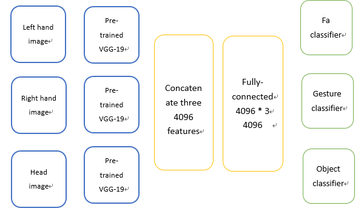
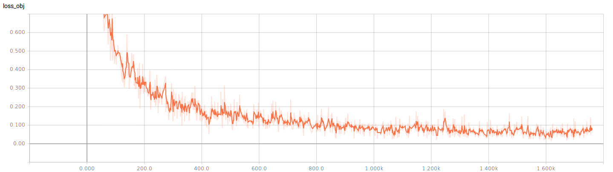

# 鄭欽安 <span style="color:red">  (103061148)</span>

# Homework 1: Deep Classification

## Overview
The project is related to Handcam dataset object classification


## Implementation
1. It's inplemented in tensorflow 1.2.1
  
2. Use VGG-19 model pre-trained on ImageNet to extract features 
  
3. Model Architure  



4. Use multi-task learning, because I think free/active, gesture labels can help train object labels and avoid overfitting 

5. Align lefthand ,righthand and head informations to share features and classify    

6. Detail  
  * learning rate = 0.0001  
  
  * add regularization hyperparameter (=0.0001) in last fc layer 
  
  * use one dropout
  
  * batch size = 128

  


## Installation
* Tensorflow  

* Pre-trained model  [VGG-19 tensorflow](https://github.com/machrisaa/tensorflow-vgg), and download [vgg19.npy](https://mega.nz/#!xZ8glS6J!MAnE91ND_WyfZ_8mvkuSa2YcA7q-1ehfSm-Q1fxOvvs)  

* Skimage
  
* Extract features of frames
```
python extract_feature.py --source_path={data_path} --target_path={targe_feature_path} --batch_size={batch_size}
```
  
* Training  
```
python obj_fc_align.py --source_path_feature={targe_feature_path} --source_path_label={label_path} --mode=train --batch_size={batch_size} --model={model_path}
```
  
* Testing
```
python obj_fc_align.py --source_path_feature={targe_feature_path} --source_path_label={label_path} --mode=testing --batch_size={batch_size} --model={model_path}
```
* Tensorboard  
```
tensorboard --logdir=./graph  
```   

### Results  

* loss
  

* accuracy  
<table>
<tr>
<td>
testing accuracy
</td>
<td>
65.84%  
</td>
</tr>


</table>


